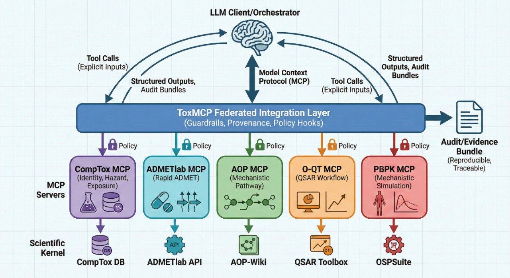

[](https://github.com/ToxMCP/toxmcp/releases)
[](https://doi.org/10.64898/2026.02.06.703989)
[](./LICENSE)
[](https://modelcontextprotocol.io/)

# ToxMCP Suite

**ToxMCP** is a suite of **guardrailed, auditable agentic workflows** for computational toxicology delivered through the **Model Context Protocol (MCP)**.

- Preprint (bioRxiv): https://doi.org/10.64898/2026.02.06.703989
- Citation metadata: [`CITATION.cff`](./CITATION.cff)

## Architecture



## Getting started

1) Pick a module below (CompTox is the showcase; ADMETlab is the lowest-friction).
2) Follow that repo’s **Quickstart TL;DR**.
3) Verify with the **Verification (smoke test)** curl snippet.

### Default ports (examples)

- CompTox MCP: http://localhost:8000
- O-QT MCP: http://localhost:8001
- PBPK MCP: http://localhost:8002
- AOP MCP: http://localhost:8003
- ADMETlab MCP: http://localhost:8200

## What is MCP?

MCP (Model Context Protocol) is a standard way for LLM clients/orchestrators to call external tools over a structured interface.
See the official MCP docs/spec: https://modelcontextprotocol.io/

## Modules

| Module | What it covers | Upstream dependency | Requirements | Repo |
| --- | --- | --- | --- | --- |
| **CompTox MCP** | Identity, hazard, exposure | EPA CompTox API | **API key required** (`CTX_API_KEY`) | https://github.com/ToxMCP/comptox-mcp |
| **ADMETlab MCP** | Rapid ADMET prediction + utilities | ADMETlab 3.0 API | No key by default (upstream may rate-limit) | https://github.com/ToxMCP/admetlab-mcp |
| **AOP MCP** | Mechanistic pathways + authoring workflows | AOP-Wiki / AOP-DB / federation | Internet access recommended | https://github.com/ToxMCP/aop-mcp |
| **O-QT MCP** | OECD QSAR Toolbox workflows + reports | OECD QSAR Toolbox WebAPI | Requires QSAR Toolbox WebAPI access | https://github.com/ToxMCP/oqt-mcp |
| **PBPK MCP** | PBPK simulation control + PK analytics | Open Systems Pharmacology Suite | Local engine setup (see repo) | https://github.com/ToxMCP/pbpk-mcp |

### Which one should I try first?

- If you want the **lowest-friction first run**, start with **ADMETlab MCP**.
- If you want the most **on-brand toxicology dataset integration**, start with **CompTox MCP** (you’ll need an API key).

## Docs

Start here: [docs/README.md](./docs/README.md)

## Notes

- Each MCP server is versioned and released independently.
- Some modules depend on proprietary or rate-limited upstream services—check each module README for exact setup.

## Acknowledgements / Origins

ToxMCP was developed in the context of the **VHP4Safety** project (see: https://github.com/VHP4Safety) and related research/engineering efforts.

Funding: Dutch Research Council (NWO) — NWA.1292.19.272 (NWA programme)

This suite integrates with third-party data sources and services (e.g., EPA CompTox, ADMETlab, AOP resources, OECD QSAR Toolbox, Open Systems Pharmacology). Those upstream resources are owned and governed by their respective providers; users are responsible for meeting any access, API key, rate limit, and license/EULA requirements described in each module.

## License

Apache-2.0

## ✅ Citation

Djidrovski, I. **ToxMCP: Guardrailed, Auditable Agentic Workflows for Computational Toxicology via the Model Context Protocol.** bioRxiv (2026). https://doi.org/10.64898/2026.02.06.703989

```bibtex
@article{djidrovski2026toxmcp,
  title   = {ToxMCP: Guardrailed, Auditable Agentic Workflows for Computational Toxicology via the Model Context Protocol},
  author  = {Djidrovski, Ivo},
  journal = {bioRxiv},
  year    = {2026},
  doi     = {10.64898/2026.02.06.703989},
  url     = {https://doi.org/10.64898/2026.02.06.703989}
}
```

Citation metadata: [`CITATION.cff`](./CITATION.cff)

## Contributing

Please see [CONTRIBUTING.md](./CONTRIBUTING.md). If you’re not sure which repository to use, open an issue here: https://github.com/ToxMCP/toxmcp/issues

## Support

See [SUPPORT.md](./SUPPORT.md).
